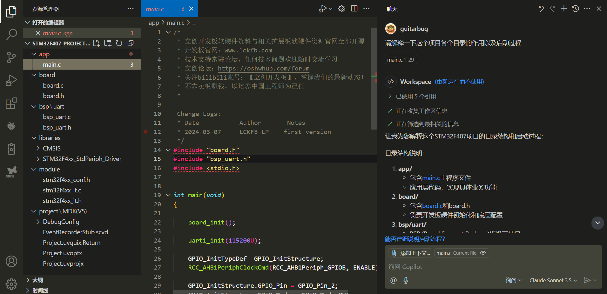

# Running FreeRTOS on STM32F407 with VS Code + STM32 VS Code Extension

# 安装好VS Code和 STM32 VS Code Extension
# 安装好 STM32CubeCLT_1.18.0

# 通过VS Code中的STM32插件创建空白工程
[[attachment/93fcb64e0430ac361b9e9209066b3ba3_MD5.png|Open: Pasted image 20250718151741.png]]
[[attachment/dab391222a3a038cb930da427df5b4ad_MD5.png|Open: Pasted image 20250718151900.png]]
\
[[attachment/23273680ea305dc6e86fcb144dc9d79f_MD5.png|Open: Pasted image 20250718152108.png]]

[[attachment/d3f8c1cdd2bf7978e2aaae91cd24febb_MD5.png|Open: Pasted image 20250718152146.png]]

[[attachment/15c04332a9e33e54b7d57db7785e409d_MD5.png|Open: Pasted image 20250718152223.png]]

[[attachment/1af55ca3372771693c84094f3e901f81_MD5.png|Open: Pasted image 20250718152646.png]]


# 移植在Keil MDK中 可以正常运行的例程 到 VS Code
 [[attachment/5788ad2425f260f761ab874c19694899_MD5.png|Open: Pasted image 20250721161100.png]]

 
将 board\, bsp\, libraries\, module\ 复制 到 目录 stm32f407_freertos, 将app\main.c复制到stm32f407_freertos\Src\覆盖main.c
 `
 ==guitarbug: 请解释一下这个项目各个目录的作用以及启动过程==

Workspace: 正在收集工作区信息正在筛选到最相关的信息让我为您解释这个STM32F407项目的目录结构和启动过程：

### 目录结构说明：

1. **app/**
   - 包含[main.c](d:\code\STM32F407_ProjectTemplate\app\main.c)主程序文件
   - 应用层代码，实现具体业务功能

2. **board/**
   - 包含[board.c](d:\code\STM32F407_ProjectTemplate\board\board.c)和board.h
   - 负责开发板硬件初始化和底层配置

3. **bsp/uart/**
   - BSP (Board Support Package)板级支持包
   - [bsp_uart.c](d:\code\STM32F407_ProjectTemplate\bsp\uart\bsp_uart.c)实现串口相关功能

4. **libraries/**
   - **CMSIS/**: ARM Cortex-M系列处理器的标准接口
   - **STM32F4xx_StdPeriph_Driver/**: ST官方外设驱动库
      - inc/: 头文件
      - src/: 源文件

5. **module/**
   - 包含中断配置(stm32f4xx_it.c)
   - 外设配置文件(stm32f4xx_conf.h)

6. **project/MDK(V5)/**
   - Keil MDK工程文件
   - 包含编译、调试等配置

### 启动过程：

1. **上电复位**
   - 从0x0800 0000启动
   - 加载向量表
   - 初始化堆栈指针(SP)

2. **系统初始化**
   - `board_init()`执行基础硬件初始化
   - 配置时钟、中断等

3. **外设初始化**
   - `uart1_init(115200U)`初始化UART1
   - 配置GPIO（LED控制）

4. **主循环**
   - LED闪烁
   - 通过串口打印状态信息

这个工程采用了典型的STM32分层架构，通过标准外设库实现对硬件的控制。
`
# 开始编译main.c, 有报错, 修改CMake
1. 错误1, ==头文件找不到==:
[[attachment/ceefa87600ffeae5eae1b73fc398bf6a_MD5.png|Open: Pasted image 20250721163250.png]]

[[attachment/46b7a6f99f3eed7ebb1cf1eaf895cbcd_MD5.png|Open: Pasted image 20250721164607.png]]
==修改 cmake\vscode_generated.cmake , 在# Include directories 那部分里 增加 ${CMAKE_CURRENT_SOURCE_DIR}/board==

其他头文件找不到的错误, 都增加include路径即可, 以下是修改完的vscode_generated.cmake:
```# Include directories

set(include_c_DIRS ${include_c_DIRS}

    ${CMAKE_CURRENT_SOURCE_DIR}/Inc

    ${CMAKE_CURRENT_SOURCE_DIR}/board

    ${CMAKE_CURRENT_SOURCE_DIR}/bsp/uart

    ${CMAKE_CURRENT_SOURCE_DIR}/libraries/CMSIS/Device/ST/STM32F4xx/Include

    ${CMAKE_CURRENT_SOURCE_DIR}/libraries/CMSIS/Include

    ${CMAKE_CURRENT_SOURCE_DIR}/libraries/STM32F4xx_StdPeriph_Driver/inc

)
```
2. 未指定芯片类型: 在main.c中最前面的第一行增加 `#define STM32F40_41xxx`
[[attachment/3a894373268d4a6c949ce82b1caf0182_MD5.png|Open: Pasted image 20250721170331.png]]

3. 找不到GPIO结构体定义: 在main.c 增加 `#include "stm32f4xx_gpio.h"`, 
[[attachment/cee18a5d98b71b8d1ae33f2ab463c410_MD5.png|Open: Pasted image 20250721171303.png]]

4. 找不到 RCC_AHB1Periph_GPIOB 定义, 在main.c 增加 `#include "stm32f4xx_rcc.h"`
[[attachment/c100db912273e2084e8d91c7512734c4_MD5.png|Open: Pasted image 20250721171745.png]]

==至此 main.c编译通过. 接下来编译和链接 整个工程==
1. 链接不到board_init等函数, 那是因为相关的c文件没有编译, 在cmake\vscode_generated.cmake 中增加相关c文件的编译.
[[attachment/0ee091298e0ea9d9c67b029c6b441337_MD5.png|Open: Pasted image 20250721173334.png]]


2. 先增加 ${CMAKE_CURRENT_SOURCE_DIR}/board/board.c, 并单独编译board.c, 解决编译错误. 
[[attachment/db925c80b776d3d5bc77ab6330b744e6_MD5.png|Open: Pasted image 20250721174407.png]]

3. 添加 bsp\uart\bsp_uart.c, 并编译相关的c文件, 直至解决所有编译错误, 多数均为头文件未包括导致找不到相关定义的错误.
[[attachment/e214d64d253eb2f15c152eb22dd4c397_MD5.png|Open: Pasted image 20250722085637.png]]


4. 继续编译和链接整个工程, 提示未链接到RCC_AHB1PeriphClockCmd等函数, 这是ST标准库的函数, 所以需要把这个工程所用到的ST标准库的c文件加入编译列表, 在cmake\vscode_generated.cmake 中增加以下相关c文件的编译:
```
${CMAKE_CURRENT_SOURCE_DIR}/libraries/STM32F4xx_StdPeriph_Driver/src/stm32f4xx_rcc.c
${CMAKE_CURRENT_SOURCE_DIR}/libraries/STM32F4xx_StdPeriph_Driver/src/stm32f4xx_gpio.c
${CMAKE_CURRENT_SOURCE_DIR}/libraries/STM32F4xx_StdPeriph_Driver/src/misc.c
${CMAKE_CURRENT_SOURCE_DIR}/libraries/STM32F4xx_StdPeriph_Driver/src/stm32f4xx_usart.c
${CMAKE_CURRENT_SOURCE_DIR}/libraries/CMSIS/Device/ST/STM32F4xx/Source/Templates/system_stm32f4xx.c    
```
    
[[attachment/5d90491426d81cd3992d9cc659f2ec31_MD5.png|Open: Pasted image 20250722090415.png]]

5. 在 cmake\vscode_generated.cmake 中的源文件之前 添加全局宏定义
```# 添加全局宏定义

add_definitions(

    -DSTM32F40_41xxx #指定STM32F4设备系列

    -DUSE_STDPERIPH_DRIVER #启用标准外设库

    -DUSE_FULL_ASSERT    # 启用断言功能

)
```

6.  断言 `assert_param` 未定义的问题。这是因为在 STM32 标准外设库中，需要启用断言功能。这里选择在main.c实现断言函数:
```
#ifdef USE_FULL_ASSERT

void assert_failed(uint8_t* file, uint32_t line)

{

    /* User can add his own implementation to report the file name and line number,

       for example: printf("Wrong parameters value: file %s on line %d\r\n", file, line) */

  

    /* Infinite loop */

    while (1)

    {

    }

}

#endif
```
8. 解决printf打印不输出到UART的问题, 对于GCC编译器,我们可以实现`_write`和`_read`函数来支持`printf`和`scanf`等输入函数。改写bsp\uart\bsp_uart.c 如下:
```
/* retarget the C library printf function to the USART */

// 重定向 printf 到 UART1

#ifdef __GNUC__

int _write(int fd, char *ptr, int len)

{

    // 忽略文件描述符检查，因为我们只重定向到UART1

    for(int i = 0; i < len; i++)

    {

        // 等待上一次发送完成

        while(USART_GetFlagStatus(USART1, USART_FLAG_TXE) == RESET);

        // 发送数据

        USART_SendData(USART1, (uint8_t)ptr[i]);

        // 等待发送完成

        while(USART_GetFlagStatus(USART1, USART_FLAG_TC) == RESET);

    }

    return len;  // 返回实际写入的字节数

}

#else

int fputc(int ch, FILE *f)

{

    USART_SendData(USART1, (uint8_t)ch);

    while( RESET == USART_GetFlagStatus(USART1, USART_FLAG_TXE) ){}

    return ch;

}

#endif

  

#ifdef __GNUC__

int _read(int fd, char *ptr, int len)

{

    int rxed = 0;

    while(rxed < len)

    {

        // 等待接收数据

        while(USART_GetFlagStatus(USART1, USART_FLAG_RXNE) == RESET)

        {

            // 可以添加超时处理

            if(rxed > 0) break;  // 如果已经收到一些数据就返回

        }

        // 检查是否真的有数据

        if(USART_GetFlagStatus(USART1, USART_FLAG_RXNE) == SET)

        {

            *ptr++ = USART_ReceiveData(USART1);

            rxed++;

        }

        else

        {

            break;

        }

    }

    return rxed;  // 返回实际读取的字节数

}

#endif
``` 

11. ==至此, Keil MDK中 可以正常运行的例程 已经成功移植大 到 VS Code的空白工程. 接下来移植FreeRTOS==
12. 先从 FreeRTOS-LTS压缩包里, 将FreeRTOS Kernel: FreeRTOS-LTS\FreeRTOS\FreeRTOS-Kernel\ 复制到本项目. 
[[attachment/9149b8049bf3981b22d84fb545389a53_MD5.png|Open: Pasted image 20250722143545.png]]

13. 在cmake\vscode_generated.cmake 添加 FreeRTOS源文件和include路径
```
  

# Sources

set(sources_SRCS ${sources_SRCS}

    ${CMAKE_CURRENT_SOURCE_DIR}/Src/main.c

    ${CMAKE_CURRENT_SOURCE_DIR}/Src/syscall.c

    ${CMAKE_CURRENT_SOURCE_DIR}/Src/sysmem.c

    ${CMAKE_CURRENT_SOURCE_DIR}/Startup/startup_stm32f407vetx.s

    ${CMAKE_CURRENT_SOURCE_DIR}/board/board.c

    ${CMAKE_CURRENT_SOURCE_DIR}/bsp/uart/bsp_uart.c

    ${CMAKE_CURRENT_SOURCE_DIR}/libraries/STM32F4xx_StdPeriph_Driver/src/stm32f4xx_rcc.c

    ${CMAKE_CURRENT_SOURCE_DIR}/libraries/STM32F4xx_StdPeriph_Driver/src/stm32f4xx_gpio.c

    ${CMAKE_CURRENT_SOURCE_DIR}/libraries/STM32F4xx_StdPeriph_Driver/src/misc.c

    ${CMAKE_CURRENT_SOURCE_DIR}/libraries/STM32F4xx_StdPeriph_Driver/src/stm32f4xx_usart.c

    ${CMAKE_CURRENT_SOURCE_DIR}/libraries/CMSIS/Device/ST/STM32F4xx/Source/Templates/system_stm32f4xx.c

    ${CMAKE_CURRENT_SOURCE_DIR}/FreeRTOS-Kernel/croutine.c

    ${CMAKE_CURRENT_SOURCE_DIR}/FreeRTOS-Kernel/event_groups.c

    ${CMAKE_CURRENT_SOURCE_DIR}/FreeRTOS-Kernel/list.c

    ${CMAKE_CURRENT_SOURCE_DIR}/FreeRTOS-Kernel/queue.c

    ${CMAKE_CURRENT_SOURCE_DIR}/FreeRTOS-Kernel/stream_buffer.c

    ${CMAKE_CURRENT_SOURCE_DIR}/FreeRTOS-Kernel/tasks.c

    ${CMAKE_CURRENT_SOURCE_DIR}/FreeRTOS-Kernel/timers.c

    ${CMAKE_CURRENT_SOURCE_DIR}/FreeRTOS-Kernel/portable/MemMang/heap_4.c

    ${CMAKE_CURRENT_SOURCE_DIR}/FreeRTOS-Kernel/portable/GCC/ARM_CM4F/port.c

)

  

# Include directories

set(include_c_DIRS ${include_c_DIRS}

    ${CMAKE_CURRENT_SOURCE_DIR}/Inc

    ${CMAKE_CURRENT_SOURCE_DIR}/board

    ${CMAKE_CURRENT_SOURCE_DIR}/bsp/uart

    ${CMAKE_CURRENT_SOURCE_DIR}/module

    ${CMAKE_CURRENT_SOURCE_DIR}/libraries/CMSIS/Device/ST/STM32F4xx/Include

    ${CMAKE_CURRENT_SOURCE_DIR}/libraries/CMSIS/Include

    ${CMAKE_CURRENT_SOURCE_DIR}/libraries/STM32F4xx_StdPeriph_Driver/inc

    ${CMAKE_CURRENT_SOURCE_DIR}/FreeRTOS-Kernel/include

    ${CMAKE_CURRENT_SOURCE_DIR}/FreeRTOS-Kernel/portable/GCC/ARM_CM4F

  

)
```
[[attachment/db23cd2e69a59cb64ded92fa381bb001_MD5.png|Open: Pasted image 20250722154540.png]]


[[attachment/3883e350f28e34b990b12b272b405997_MD5.png|Open: Pasted image 20250722154600.png]]


13. 开始编译, 提示找不到 FreeRTOSConfig.h. 在Inc目录下创建FreeRTOSConfig.h文件:
```
#ifndef FREERTOS_CONFIG_H

#define FREERTOS_CONFIG_H

  

/* 包含标准库头文件 */

#include "stm32f4xx.h"

  

/* 基础配置项 */

#define configUSE_PREEMPTION                    1

#define configUSE_PORT_OPTIMISED_TASK_SELECTION 1

#define configUSE_TICKLESS_IDLE                 0

#define configCPU_CLOCK_HZ                      ( SystemCoreClock )

#define configTICK_RATE_HZ                      ( ( TickType_t ) 1000 )

#define configMAX_PRIORITIES                    ( 5 )

#define configMINIMAL_STACK_SIZE                ( ( unsigned short ) 128 )

#define configMAX_TASK_NAME_LEN                 ( 16 )

#define configUSE_16_BIT_TICKS                  0

#define configIDLE_SHOULD_YIELD                 1

#define configUSE_TASK_NOTIFICATIONS            1

#define configTASK_NOTIFICATION_ARRAY_ENTRIES   3

#define configUSE_MUTEXES                       1

#define configUSE_RECURSIVE_MUTEXES             1

#define configUSE_COUNTING_SEMAPHORES           1

#define configQUEUE_REGISTRY_SIZE              10

#define configUSE_QUEUE_SETS                    0

#define configUSE_TIME_SLICING                  1

#define configUSE_NEWLIB_REENTRANT             0

#define configENABLE_BACKWARD_COMPATIBILITY     0

#define configNUM_THREAD_LOCAL_STORAGE_POINTERS 5

#define configSTACK_DEPTH_TYPE                  uint16_t

#define configMESSAGE_BUFFER_LENGTH_TYPE        size_t

  

/* 内存分配相关配置 */

#define configSUPPORT_STATIC_ALLOCATION         0

#define configSUPPORT_DYNAMIC_ALLOCATION        1

#define configTOTAL_HEAP_SIZE                   ( ( size_t ) ( 10 * 1024 ) )

#define configAPPLICATION_ALLOCATED_HEAP        0

  

/* Hook函数相关配置 */

#define configUSE_IDLE_HOOK                     0

#define configUSE_TICK_HOOK                     0

#define configCHECK_FOR_STACK_OVERFLOW          0

#define configUSE_MALLOC_FAILED_HOOK            0

#define configUSE_DAEMON_TASK_STARTUP_HOOK      0

  

/* 运行时和任务统计相关配置 */

#define configGENERATE_RUN_TIME_STATS          0

#define configUSE_TRACE_FACILITY               0

#define configUSE_STATS_FORMATTING_FUNCTIONS   0

  

/* 协程相关配置 */

#define configUSE_CO_ROUTINES                   0

#define configMAX_CO_ROUTINE_PRIORITIES         ( 2 )

  

/* 软件定时器相关配置 */

#define configUSE_TIMERS                        1

#define configTIMER_TASK_PRIORITY              ( 2 )

#define configTIMER_QUEUE_LENGTH               10

#define configTIMER_TASK_STACK_DEPTH          ( configMINIMAL_STACK_SIZE * 2 )

  

/* 中断相关配置 */
#define configLIBRARY_LOWEST_INTERRUPT_PRIORITY         0xf

#define configLIBRARY_MAX_SYSCALL_INTERRUPT_PRIORITY    5

#define configKERNEL_INTERRUPT_PRIORITY         ( configLIBRARY_LOWEST_INTERRUPT_PRIORITY << (8 - configPRIO_BITS) )

#define configMAX_SYSCALL_INTERRUPT_PRIORITY    ( configLIBRARY_MAX_SYSCALL_INTERRUPT_PRIORITY << (8 - configPRIO_BITS) )

  

/* Cortex-M specific definitions */

#define configPRIO_BITS                         4        /* 15 priority levels */

  

/* 定义断言 */

#define configASSERT( x ) if( ( x ) == 0 ) { taskDISABLE_INTERRUPTS(); for( ;; ); }

  

/* 可选函数配置 - 设置为1表示包含该功能 */

#define INCLUDE_vTaskPrioritySet                1

#define INCLUDE_uxTaskPriorityGet               1

#define INCLUDE_vTaskDelete                     1

#define INCLUDE_vTaskCleanUpResources           0

#define INCLUDE_vTaskSuspend                    1

#define INCLUDE_vTaskDelayUntil                 1

#define INCLUDE_vTaskDelay                      1

#define INCLUDE_xTaskGetSchedulerState          1

#define INCLUDE_xTaskGetCurrentTaskHandle       1

#define INCLUDE_uxTaskGetStackHighWaterMark     0

#define INCLUDE_xTaskGetIdleTaskHandle          0

#define INCLUDE_eTaskGetState                   0

#define INCLUDE_xTimerPendFunctionCall         0

#define INCLUDE_xTaskAbortDelay                0

#define INCLUDE_xTaskGetHandle                 0

#define INCLUDE_xQueueGetMutexHolder           1

  

/* 定义中断处理函数名 */

#define vPortSVCHandler     SVC_Handler

#define xPortPendSVHandler  PendSV_Handler

#define xPortSysTickHandler SysTick_Handler

  

#endif /* FREERTOS_CONFIG_H */
```

14. 修改main.c, 使用FreeRTOS创建任务. 以下时完整的main.c 文件
```
/*

 * 立创开发板软硬件资料与相关扩展板软硬件资料官网全部开源

 * 开发板官网：www.lckfb.com

 * 技术支持常驻论坛，任何技术问题欢迎随时交流学习

 * 立创论坛：https://oshwhub.com/forum

 * 关注bilibili账号：【立创开发板】，掌握我们的最新动态！

 * 不靠卖板赚钱，以培养中国工程师为己任

 *

  

 Change Logs:

 * Date           Author       Notes

 * 2024-03-07     LCKFB-LP    first version

 */

#include "stm32f4xx_conf.h"

#include "stm32f4xx.h"

#include "board.h"

#include "bsp_uart.h"

#include <stdio.h>

#include "stm32f4xx_gpio.h"

#include "stm32f4xx_rcc.h"

  

// for FreeRTOS

#include "FreeRTOS.h"

#include "task.h"

  

#ifdef USE_FULL_ASSERT

void assert_failed(uint8_t* file, uint32_t line)

{

    /* User can add his own implementation to report the file name and line number,

       for example: printf("Wrong parameters value: file %s on line %d\r\n", file, line) */

  

    /* Infinite loop */

    while (1)

    {

    }

}

#endif

  

// LED任务实现

void LedTask(void *argument) {

    const TickType_t xDelay = pdMS_TO_TICKS(1000); // 将1000ms转换为tick数

    printf("LedTask started!\r\n");  // 添加任务启动提示

  

    for (;;) {

        GPIO_SetBits(GPIOB, GPIO_Pin_2);

        printf("freertos LedTask: LED ON!\r\n");

        vTaskDelay(xDelay);  // 使用FreeRTOS的延迟函数

        GPIO_ResetBits(GPIOB, GPIO_Pin_2);

        printf("freertos LedTask: LED OFF!\r\n");

        vTaskDelay(xDelay);  // 使用FreeRTOS的延迟函数

    }

}

  

//监控系统状态任务实现

void vTaskStats(void *argument) {

    const TickType_t xDelay = pdMS_TO_TICKS(5000);  // 5秒打印一次

    uint32_t counter = 0;

    for(;;) {

        printf("\r\n=== Task Stats %lu ===\r\n",counter++);

        printf("Free Heap: %d bytes\r\n", xPortGetFreeHeapSize());

        printf("Min Free Heap: %d bytes\r\n", xPortGetMinimumEverFreeHeapSize());

        vTaskDelay(xDelay);

    }

}

  

int main(void)

{

    board_init();

    uart1_init(115200U);

  

    GPIO_InitTypeDef  GPIO_InitStructure;

    RCC_AHB1PeriphClockCmd(RCC_AHB1Periph_GPIOB, ENABLE);

  

    GPIO_InitStructure.GPIO_Pin = GPIO_Pin_2;

    GPIO_InitStructure.GPIO_Mode = GPIO_Mode_OUT;

    GPIO_InitStructure.GPIO_OType = GPIO_OType_PP;

    GPIO_InitStructure.GPIO_Speed = GPIO_Speed_100MHz;

    GPIO_InitStructure.GPIO_PuPd = GPIO_PuPd_NOPULL;

    GPIO_Init(GPIOB, &GPIO_InitStructure);

  

    // 使用printf测试

    printf("Hello World!!!\r\n");

    printf("SystemCoreClock = %lu Hz\r\n", SystemCoreClock);

  

    // 创建LED任务

    BaseType_t xReturn = xTaskCreate(

        LedTask,                   // 任务函数

        "LED Task",                // 任务名称

        configMINIMAL_STACK_SIZE * 8, // 栈大小（单位：字）

        NULL,                      // 参数

        tskIDLE_PRIORITY + 3,      // 优先级

        NULL            // 任务句柄

    );

  

    if(xReturn != pdPASS)

    {

        printf("LED Task creation failed!\r\n");

        while(1);

    }    

    //创建监控系统状态任务

    xTaskCreate(

        vTaskStats,                   // 任务函数

        "Task Stast",                // 任务名称

        configMINIMAL_STACK_SIZE * 4, // 栈大小（单位：字）

        NULL,                      // 参数

        tskIDLE_PRIORITY + 1,      // 优先级

        NULL            // 任务句柄

    );

  

    //配置系统节拍定时器

    if (SysTick_Config(SystemCoreClock / configTICK_RATE_HZ) != 0) {

        printf("SysTick configuration failed!\r\n");

        while(1);

    }

    // 启动FreeRTOS调度器

    vTaskStartScheduler();

  

    /* 如果程序运行到这里，说明系统出错 */

    printf("Scheduler start failed!\r\n");

  

    // 如果调度器启动成功，以下代码不会运行    

    while(1)

    {

        GPIO_SetBits(GPIOB, GPIO_Pin_2);

        printf("LED On!\r\n");

        delay_ms(100);

        GPIO_ResetBits(GPIOB, GPIO_Pin_2);

        printf("LED Off!\r\n");

        delay_ms(100);

    }

  

}
```